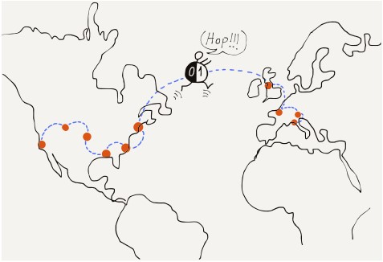

 

Chapter 1 Introduction
======================

Menggunakan Internet nampaknya cukup mudah. Kita pergi pada sebuah alamat web
dan halaman pun muncul. Atau kita pergi pada situs sosial favorit kita dan
melihat foto dari teman-teman kita, keluarga, dan hewan-hewna peliharaan. Tetapi
itu memerlukan software dan hardware yang kompleks untuk membuat Internet nampak
sangat sederhana. Desain Teknologi yang membuat Internet hari ini bekerja
dimulai pada tahun 1960-an oleh akademisi di sebuah proyek yang disebut NSFNet.
Sejak saat itu, penelitian dan pengembangan ke peningkatan teknologi jaringan
terus berlanjut sebagai jaringan yang sudah menjadi jauh lebih besar dan cepat
dan dihubungkan secara global pada jutaan komputer.

 

agar mudah dipahami bagaimana Internet hari ini bekerja, kita akan melihat
bagaimana manusia dan komputer telah berkomunikasi menggunakna teknologi selama
bertahun-tahun.

 

Communicating at a Distance (*berkomunikasi pada suatu Jarak*)
--------------------------------------------------------------

Bayangan sebuah grup yang terdiri dari lima orang di dalam suatu ruangan duduk
dalam sebuah lingkaran. Selama mereka sopan dan tidak mempunyai lebih dari satu
percakapan pada saat bersamaan, itu sangat alami bagi siapapaun yang berbicara
kepada orang lain dalam ruangan. Mereka hanya harus mampu mendengar satu sama
lain dan mengkoordinasikan (menyelaraskan) bagaimana menggunakan tempat bersama
dalam satu ruangan.

 

Tetapi bagaimana jika kita menempatkan orang-orang ini dalam ruangan yang
berbeda sehingga mereka tidak bisa lagi melihat atau mendengar satu sama lain?
bagaimana setiap pasangan dapat berkomunikasi dengan yang lainnya kemudian?
salah satu cara yang mungkin adalah dengan merentangkan seutas kabel di antara
setiap pasangan dengan sebuah *microphone* pada ujung yang satu dan sebuah
*speaker* pada ujung yang lain. Sekarang semua orang masih dapat mendengar
setaip percakapan. Mereka masih perlu sopan untuk meyakinkan bahwa hanya ada
satu percakapan yang sedang terjadi pada waktu bersamaan.

 

Setiap orang akan membutuhkan empat *speaker* (satu untuk setiap orang yang
lainnya) dan potongan kabel yang cukup untuk menghubungkan semua *microphone*
dan *speaker*. Ini adalah sebuah kesulitan dengan lima orang dan itu akan
menjadi jauh lebih buruk ketika ada ratusan atau ribuan orang (yang saling
terhubung).

 

menggunakan kabel, *microphone*, dan *speaker* adalah bagaimana sistem telepon
awal pada tahun 1900-an memperkenankan orang untuk melakukan panggilan telepon.
Karena mereka tidak dapat memiliki kabel terpisah antara setiap pasang telepon,
sistem ini tidak mengizinkan setiap pasangan untuk terhubung pada waktu yang
bersamaan. Setiap orang mempunyai satu koneksi tunggal ke seorang “operator”.
Operator akan mengkoneksian dua kabel bersamaan untuk mengizinkan sepasang orang
untuk berbicara, dan kemudian memutuskan koneksinya ketika percakapan berakhir.

Sistem telepon lokal pertama bekerja dengan baik ketika rumah\* *atau bisnis*
customer \*dekat dengan bangunan operator dan seutas kabel dapat disambung
dengan segera dari bangunan operator ke rumah orang tersebut.

 

Tetapi bagaimana jika ribuan orang yang terpisah ratusan kilometer harus mampu
berkomunikasi? Kita tidak dapat merentangkan 100 kilometer kabel dari setiap
rumah ke satu-satunya kantor pusat. Apa yang dilakukan perusahaan telepon
sebagai gantinya adalah dengan memiliki lebih banyak kantor pusat dan
merentangkan beberapa kabel antar kantor pusat, kemudian membagikan koneksi
antar kantor pusat. untuk jarak yang jauh, satu koneksi mungkin menjalar melalui
sebuah nomor dari kantor pusat. Sebelum datangnya *fiber optic*, panggilan
telepon jarak-jauh dilakukan antar tiang kota dengan banyaknya kabel terpisah.
Nomor kabel-kabel pada tiang mewakili nomor dari panggilan telepon jarak jauh
yang mungkin saja simultan yang menggunakan kabel-kabel ini.

Semenjak itu biaya dari kabel naik karena panjang dari kabel meningkat, koneksi
yang lebih panjang antara kantor-kantor ini cukup mahal untuk dipasang dan
dipelihara, dan itu cukup langka. Jadi pada hari-hari awal telepon,
panggilan-panggilan lokal umumnya cukup murah. Tetapi panggilan jarak jauh lebih
mahal dan itu ditagih setiap menit. Ini masuk akal karena setiap menit kamu
bercakap dalam panggilan jarak jauh, penggunaan kamu atas kabel jarak jauh
menandakan tidak seorang pun dapat menggunakannya. Perusahaan telepon
menginginkan panggilanmu ringkas sehingga saluran jarak-jauh mereka akan
tersedia untuk *customer* lain.

 

Ketika perusahaan telepon mulai menggunakan *fiber optic*, teknik yang lebih
maju digunakan untuk mengantarkan banyaknya percakapan jarak jauh yang simultan
pada *satu fiber* tunggal. Ketika kamu melihat pada foto jadul dan melihat
bayaknya kabel pada satu tiang tunggal, itu umumnya menandakan kabel telepon dan
tidak digunakan untuk mengantarkan aliran listrik.

 

Computers Communicate Differently (*komputer Berkomunikasi Secara Berbeda*)
---------------------------------------------------------------------------

 

Ketika manusia berbicara di telepon, mereka melakukan panggilan, berbicara
selama beberapa saat, dan kemudian menutup panggilan. Secara statistik, sebagian
besar waktu, manusia tidak berbicara di telepon. Setidaknya sebelumnya mereka
semua tidak mempunyai *smartphone*. tetapi komputer, termasuk aplikasi pada
*smartphone* -mu, berkomunikasi secara berbeda dibandingkan manusia.\*
*Kadang-kadang komputer mengirim pesan singkat untuk memeriksa jika komputer
lain tersedia. Terkadang komputer mengirim informasi dengan ukuran sedang
seperti* single picture\* atau pesan email yang panjang. Dan terkadang komputer
mengirimkan banyak informasi seperti *movie* (dengan durasi penuh) atau sebuah
*software* untuk dipasang yang mungkin memamakan waktu beberapa menit atau
bahkan beberapa jam untuk didownload. Jadi pesan antar komputer dapat berukuran
kecil (ringkas), sedang, ataupun panjang (berukuran besar).

 

Di hari-hari paling awal menghubungkan beberapa komputer satu sama lain, pasang
komputer dikoneksikan dengan kabel. Cara paling mudah untuk mengirimkan data
dari satu komputer ke yang lainnya adalah dengan membariskan pesan keluar dalam
satu antrian dan mengirimkan pesan satu demi satu secepat komputer tersebut dan
kabel dapat membawa data tersebut. Setiap pesan akan menunggu selama gilirannya
sampai pesan yang ada di depannya dikirim, dan kemudian pesan tersebut mendapat
gilirannya untuk dikirimkan melalui koneksi tersebut.

 

Ketika beberapa komputer berada di gedung yang sama, pemilik gedung dapat
menjalarkan kabel untuk menkoneksikannya. Jika beberapa komputer berada dalam
kota yang sama, pemilik komputer-komputer tersebut biasanya harus menyewa kabel
dari perusahaan telepon untuk mengkoneksikan komputer-komputernya. Mereka sering
meminta perusahaan telepon menghubungkan kabel satu sama lain pada kantor pusat
mereka sehingga tidak diperlukan untuk satu komputer “memanggil (dial)” komputer
lain untuk mengirimkan data. Jalur sewaan (*leased line*) ini nyaman untuk
komunikasi komputer karena “selalu aktif”, tetapi itu juga cukup mahal karena
digunakan 24 jam sehari.

 

Ketika komputer-komputer itu bahkan lebih jauh pun, pada kota yang berbeda,
jalur sewaan ini diperluas menggunakan kabel yang sangat panjang menghubungkan
kantor-kantor pusat tersebut. Ketika ada begitu sedikit kabel antara kantor
pusat, jalur sewaan jarak jauh ini cukup mahal dan harganya meningkat secara
dramatis karena panjang jalur sewaan meningkat. Tetapi jika kamu mempunyai cukup
uang, kamu dapat menyewa koneksi langsung antar komputermu sehingga dapat
bertukar data (seperti meyewa koneksi pribadi). Ini bekerja dengan cukup baik
selama kamu hanya menggunakan satu merek komputer, karena setiap perusahaan
komputer mempunyai cara mereka sendiri menggunakan kabel telepon untuk
mengkoneksikan komputer-komputernya satu sama lain dan mengirimkan data.

 

Early Wide Area Store-and-Forward Networks (*Jaringan Store-and-Forward Area Wide Awal*)
----------------------------------------------------------------------------------------

 

pada tahun 1970-an dan 1980-an, orang-orang yang bekerja di universitas
diseluruh dunia ingin mengirimkan data satu sama lain dan pesan menggunakan
koneksi *computer-to-computer* ini. Sejak harga untuk tiap-tiap koneksi sangat
tinggi dan meningkat bersamaan dengan jarak, komputer pada dasarnya hanya
mempunyai koneksi untuk komputer lain didekatnya. Tetapi jika komputer yang kamu
koneksikan terkoneksi ke komputer lain dan komputer itu pada gilirannya
terkoneksi ke komputer lain, dan seterusnya, kamu dapat mengirimkan pesan jarak
jauh selama masing-masing komputer di sepanjang rute pesan setuju untuk
menyimpan dan meneruskan pesan kamu.

Dari waktu ke waktu, dengan koneksi yang relatif sedikit kamu dapat mengirimkan
data jarak jauh melalui sebuah *patchwork* koneksi jaringan selama kamu
bersabar. Sepanjang jalan, setelah pesan kamu terkirim pada satu komputer, itu
harus menunggu sampai gilirannya tiba untuk dikirim ke komputer berikutnya
sepanjang rutenya. Sebuah pesan akan tiba pada komputer perantara, disimpan
untuk sementara waktu (bisa jadi berjam-jam, tergantung lalu lintas data), dan
kemudian di teruskan ke satu koneksi lagi (atau “*hop*”).

 

Mengirimkan seluruh pesan satu per satu dengan cara ini, sebuah pesan mungkin
memakan waktu beberapa menit, jam, atau bahkan hari untuk tiba pada tujuan
akhirnya, tergantung pada lalu lintas data pada di setiap *hop*. walaupun bahkan
jika itu memakan waktu beberapa jam untuk sebuah pesan email untuk menemukan
rutenya dari satu daerah ke daerah negara lainnya, ini masih jauh lebih cepat
dan lebih mudah daripada mengirim surat atau kartu pos.

 

Packet and Routers
------------------

Inovasi yang paling penting yang memungkinkan banyak pesan bergerak lebih cepat
melintasi banyak *hop* (*multi-hop*) jaringan adalah dengan memecahkan setiap
pesan menjadi bagian-bagian kecil dan mengirimkan setiap bagian secara individu.
Dalam istilah jaringan, potongan pesan ini di sebut “paket-paket /*packets*“.
Ide memecahkan sebuah pesan ke dalam paket-paket dirintis pada tahun 1960-an,
tetapi itu tidak luas digunakan sampai tahun 1980-an karena membutuhkan lebih
banyak kemampuan komputasi dan *software* jaringan yang canggih.

 

Ketika pesan di pecah ke dalam paket-paket dan setiap paket di kirim secara
terpisah, jika pesan singkat di kirim setelah pesan panjang mulai (dikirim),
pesan singkat tidak harus menunggu sampai seluruh pesan panjang selesai
terkirim. Paket pertama dari pesan singkat hanya harus menunggu selama paket
saat ini dari pesan panjang selesai terkirim. Sistem bergantian mengirim paket
dari pesan panjang dan pendek sampai setelah beberapa saat pesan pendek
benar-benar terkirim dan pesan panjang kembali menggunakan sepenuhnya jaringan.

 

Memecah pesan ke dalam paket-paket juga benar-benar mengurangi jumlah dari
penyimpanan yang dibutuhkan dalam komputer perantara karena daripada harus
menyimpan seluruh pesan selama beberapa jam, komputer perantara hanya perlu
menyimpan beberapa paket selama beberapa detik selagi paket menunggu gilirannya
pada tautan keluar (*outbound link*).

 

saat jaringan berpindah dari pendekatan *store-and-forward*, jaringan mulai
menyertakan komputer dengan tujuan khusus (*special-purpose*) yang khusus
memindahkan paket-paket. Ini awalnya disebut “*Interface Message Processors*“
atau “IMPs” karena ini bertindak sebagai *interface* (antarmuka) antara komputer
untuk keperluan umum (*general-pupose*) dan sisa jaringan. Kemudian
komputer-komputer ini dikhususkan untuk komunikasi yang disebut “*routers*“
karena alasannya adalah (dapat) merutekan paket-paket yang komputer-komputer ini
terima menuju tujuan akhirnya.

Dengan membangun *routers* yang dikhususkan dalam memindahkan paket-paket
melintasi banyak *hop (multiple hops*), menjadikannya lebih sederhana untuk
mengkoneksikan komputer dari banyak vendor ke jaringan yang sama. Untuk
mengkoneksikan komputer manapun ke jaringan, sekarang yang perlu kita semua
lakukan adalah menghubungkannya ke satu *router* dan kemudian rincian komunikasi
yang ditinggalkan di atasi oleh *routers* lainnya.

 

Ketika ada banyak komputer pada satu lokasi dikoneksikan bersama dalam sebuah
“*Local Area Network*“ (atau LAN) menggunakan kabel fisik, kamu akan
mengkoneksikan sebuah *router* ke area jaringan lokal. Dengan mengirimkan data
melewati *router*, semua komputer yang berada di area jaringan lokal (LAN) dapat
mengirimkan data melintasi “*Wide Area Network*“ (atau WAN).

 

Addressing and Packets
----------------------

Pada jaringan *store-and-forward* awal adalah penting untuk mengetahui asal dan
tujuan untuk setiap pesan komputer. Setiap komputer di berikan nama atau nomor
yang di sebut “*address* / alamat“ dari komputer. Untuk mengirimkan sebuah pesan
ke komputer lainnya, kamu perlu menambahkan asal dan alamat tujuan ke pesan
sebelum mengirimkan pesan sepanjang jalannya. Dengan memiliki asal dan alamat
tujuan dalam setiap pesan, komputer yang menyimpan (*store*) dan meneruskan
pesan akan mampu memilih jalur terbaik (*best path*) untuk pesan jika tersedia
lebih dari satu jalur.

Ketika sebuah pesan panjang dibagi kedalam paket (*packets*) yang jauh lebih
kecil dan setiap paket dikirim secara individu, asal dan alamat tujuan harus
ditambahkan ke setiap paket, jadi *routers* dapat memilih jalur terbaik untuk
mengantarkan setiap paket dari pesan tersebut. selain asal dan alamat tujuan,
juga perlu untuk menambahkan data ke setiap paket yang menunjukkan “*offset*“
atau posisi paket dalam keseluruhan pesan sehingga komputer penerima dapat
meletakkan paket-paket kembali bersama lagi dalam posisi yang benar untuk
memulihkan pesan asli (seperti semula).

 

Putting It All Together (*Menyatukan Semuanya*)
-----------------------------------------------

Jadi ketika kita menyatukan semua ini bersama kita dapat mengerti dasar operasi
Internet hari ini. Kita memiliki komputer khusus yang disebut “*routers*“ yang
mengetahui bagaimana merutekan paket-paket sepanjang jalur dari asal sampai
tujuan. Setiap paket akan melewati banyak *router* selama perjalannya dari
komputer asal ke komputer tujuan.

 

Bahkan jika paket-paket itu mungkin bagian dari sebuah pesan yang cukup pajang,
*router* mengantarkan setiap paket terpisah berdasarkan asal dan alamat
tujuannya. Paket-paket yang berbeda dari pesan yang sama mungkin mengambil
*router* yang berbeda dari asal ke tujuannya. Dan terkadang paket bahkan keluar
dari urutan; paket terakhir yang dikirim mungkin tiba (lebih dulu) sebelum paket
awal, mungkin karena data “*traffic jam* / macet“. Setiap paket mengandung
“*offset*“ (data tentang urutan pesan panjang yang dipecah) dari awal pesan
sehingga komputer tujuan dapat mengumpulkan paket-paket tersebut kembali dalam
urutan yang benar untuk memulihkan pesan asli.

 

dengan membuat jaringan menggunakan beberapa *hop* pendek, biaya keseluruhan dan
komunikasi melintasi area geografis yang luas dapat disebarkan melalui nomor
perorangan atau grup-grup koneksi yang besar. Normalnya, paket-paket (*packets*)
akan menemukan jalur paling pendek antara asal (*source*) dan tujuan
(*destination*), tetapi jika tautan yang ada pada jalur kelebihan beban
(*overload*) atau rusak, *routers* (router-router)\* *dapat bekerja sama dan
merutekan ulang pengiriman (data/pesan dsb.) dengan mengambil jalur yang agak
panjang yang akan menerima paket dari asal (*source\*) ke tujuan secepat
mungkin.

 

Inti dari Internet adalah sekumpulan *router* yang saling bekerja sama yang
memindahkan paket-paket (*packets*) dari banyak sumber (asal) ke banyak
destinasi (tujuan )pada waktu yang bersamaan. Setiap komputer atau *local area
network*terkoneksi ke *router* yang meneruskan pengiriman dari lokasinya ke
berbagai destinasi (tujuan) di Internet. satu *router* mungkin menangani data
dari satu komputer tunggal seperti sebuah *smartphone*, dari beberapa komputer
dalam bangunan yang sama, atau dari ribuan komputer yang terkoneksi ke jaringan
kampus universitas. Istilah “Internet” datang dari ide “*internetworking*“, yang
mana menangkap gagasan mengkoneksikan banyak jaringan sacara bersamaan. Komputer
kita terkoneksi secara bersamaan jadi semua komputer kita dapat berbicara
(komunikasi) satu sama lain.

Glossary
--------

**address**: Nomor yang diberikan ke sebuah komputer sehingga pesan dapat
dirutekan ke komputer.

**hop**: Satu jaringan fisik. sebuah paket di Internet yang khusus akan membuat
beberapa “*hops* / loncatan” untuk menerima dari kompuer asalnya ke tujuannya.

**LAN**: *Local Area Network*. Jaringan yang mencakup area yang dibatasi oleh
kemampuan alat untuk merentangkan kabel atau memancarkan kekuatan pemancar
radio.

**leased line**: Koneksi yang “selalu aktif” yang organisasi tawarkan dari suatu
perusahaan telepon\* \*atau utilitas lain untuk mengirimkan data melintasi
jarang yang sangat jauh.

**operator (telephone)**: Orang yang bekerja untuk perusahaan telepon dan
menolong orang membuat panggilan telepon.

**packet**: Pecahan dengan ukuran terbatas dari sebuah pesan panjang (*large*
message). Pesan panjang atau *file* di dibagi kedalam banyak paket dan dikirim
melalui Internet. Tipikal ukuran maksimum paket adalah antara 1000 dan 3000
karakter.

**router**: Komputer khusus yang didesain untuk menerima paket masuk pada banyak
tautan dan paket dengan cepat diteruskan pada tautan keluar (*outbound link*)
yang terbaik untuk mempercepat (pengantaran) paket ke tujuannya.

**stored-and-forward network**: Suatu jaringan dimana data dikirimkan dari satu
kompute ke komputer lainnya dengan pesan disimpan untuk jangka waktu yang
relatif lama dalam sebuah komputer perantara sambil menunggu jaringan keluar
(*outbound network*) tersedia.

**WAN**: *Wide Area Network*. Jaringan yang mencakup jarak yang jauh, hingga
mengirim data sepenuhnya ke seluruh dunia. WAN pada dasarnya dibangun
menggunakan *link* (tautan) dan dikelola dengan nomor-nomor (*unique number*)
dari organisasi yang berbeda.

 

Chapter 2: Network Architecture
===============================

Untuk merencanakan dan membangun sebuah sistem sekompleks Internet, para
insinyur (*engineer*) mencoba untuk memecahkan satu masalah yang menantang ke
dalam kumpulan masalah yang lebih kecil untuk memecahkan masalah besar yang
orisinil. Para insinyur yang membuat Internet pertama memecahakan keseluruhan
masalah kedalam empat dasar *subproblem* (sub-persoalan) yang dapat dikerjakan
secara mandiri oleh grup yang berbeda.

| Application  |
| ------------ |
| Transport    |
| Internetwork |
| Link         |

Mereka memberikan empat bidang teknik ini dengan nama-nama: (1) *Link*, (2)
*Internetwork*, (3) *Transport*, dan (4) *Application*. Kita memvisualisasikan
empat bidang yang berbeda ini sebagai lapisan (*layer*) yang ditumpuk di atas
satu sama lain, dengan *Link layer* di bagian bawah dan *Application layer*
dibagian atas. Lapisan *Link* terhubung dengan kabel atau Koneksi wirelesss dari
komputermu ke local area network *(jaringan lokal*) dan *Application layer*
adalah apa yang kita sebagai *end user* berinteraksi dengannya. Web browsers
adalah salah satu contoh aplikasi yang ada di dalam arsitektur Internet ini.

 

Kita secara informal merujuk pada model ini sebagai “TCP/IP *model*“ dalam
mengacu *Transmission Control Protocol* (TCP) yang digunakan untuk menjalankan
lapisan *Transport* dan *Internet Protocol* (IP) yang digunakan untuk
menjalankan lapisan *Internetwork*.

 

Kita akan melihat sekilas masing-masing lapisan (*layer*), dimulai dari tumpukan
paling “bawah”.

 

The Link Layer
--------------

 

*Link layer* bertanggung jawab untuk menghubungkan komputermu ke jaringan lokal
(*local network*) dan memindahkan data melintasi *hop* tunggal. Teknologi *link
layer* yang paling umum saat ini adalah jaringan nirkabel (*wireless*). Saat
kamu menggunakan perangkat nirkabel, perangkat hanya mengirim data dalam jarak
pendek. Sebuah *smartphone* berkomunikasi dengan menara yang berjarak beberapa
kilometer. Jika kamu menggunakan *smartphone* -mu di kereta, ia perlu beralih ke
menara baru setiap beberapa menit saat kereta bergerak. Laptop yang terhubung ke
jaringan WiFi biasanya berkomunikasi dengan *base station* dalam jarak 200
meter. Komputer *desktop* yang dihubungkan menggunakan koneksi kabel biasanya
menggunakan kabel yang panjangnya 100 meter atau lebih pendek. Teknologi *link
layer* sering dibagikan di antara banyak komputer di lokasi yang sama.

 

*Link layer* perlu memecahkan dua masalah dasar ketika berhadapan dengan
jaringan area lokal (*local area network*) publik ini. Masalah pertama adalah
bagaimana menyandikan (*encode*) dan mengirimkan data melalui tautan (*link*).
Jika tautannya nirkabel (*wireless*), para insinyur (*engineers*) harus
menyetujui frekuensi radio mana yang akan digunakan untuk mengirimkan data dan
bagaimana data digital akan dikodekan dalam sinyal radio. Untuk koneksi kabel,
mereka harus menyetujui voltase (*voltage*) apa yang digunakan pada kabel dan
seberapa cepat untuk mengirim bit (*bits*) melintasi kabel. Untuk teknologi
*link layer* yang menggunakan *fiber optic* harus menyepakati frekuensi cahaya
(*frequencies of light*) yang akan digunakan dan seberapa cepat pengiriman data.

 

Selain menyepakati cara mengirim data menggunakan media publik seperti jaringan
nirkabel (*wireless*), mereka juga perlu menyepakati cara bekerja sama dengan
komputer lain yang mungkin ingin mengirim data secara bersamaan. Jika semua
komputer yang terkoneksi dengan jaringan mencoba mengirim kapan pun mereka
memiliki data untuk dikirim, pesannya akan bentrok. Hasilnya akan kacau, dan
stasiun penerima akan hanya akan menerima kegaduhan. Jadi kita perlu menemukan
cara yang adil untuk memungkinkan setiap stasiun menunggu gilirannya untuk
menggunakan jaringan publik (*shared network*).

 

Gagasan memecah pesan panjang menjadi *packets* dan kemudian mengirimkan setiap
paket secara terpisah membuat pengiriman ini lebih mudah. Jika hanya satu
komputer yang ingin mengirimkan data, ia akan mengirimkan *packets*-nya satu
demi satu dan memindahkan datanya melintasi jaringan secepat mungkin. Tetapi
jika tiga komputer ingin mengirim data secara bersamaan, masing-masing komputer
akan mengirim satu *packet* dan kemudian menunggu ketika dua komputer lainnya
mengirim *packets*. Setelah masing-masing komputer lain mengirimkan sebuah
*packet*, komputer pertama akan mengirimkan paket berikutnya. Dengan cara ini
komputer berbagi akses ke jaringan dengan cara yang adil.

 

Tapi bagaimana komputer tahu jika komputer lain ingin mengirim data pada saat
yang sama? Insinyur merancang metode yang cerdik untuk memecahkan masalah ini
yang disebut “*Carrier Sense Multiple Access* with *Collision Detection*“, atau
CSMA/CD. Ini nama yang panjang untuk konsep yang sederhana dan elegan. Saat
komputermu ingin mengirim data, pertama itu akan memperhatikan dengan melihat
apakah komputer lain sudah mengirim data di jaringan (*carrier Sense*). Jika
tidak ada komputer lain yang mengirim data, komputermu mulai mengirim datanya.
Saat komputermu mengirim data, ia juga memperhatikan dengan melihat apakah ia
dapat menerima datanya sendiri. Jika komputermu menerima datanya sendiri, ia
mengetahui bahwa saluran tersebut masih kosong dan melanjutkan transmisi. Tetapi
jika dua komputer mulai mengirim pada waktu yang hampir bersamaan, data akan
bertabrakan, dan komputermu tidak menerima datanya sendiri. Ketika tabrakan
terdeteksi, kedua komputer berhenti mentransmisikan, menunggu sebentar, dan
mencoba lagi transmisi. Kedua komputer yang bertabrakan menunggu dengan panjang
waktu yang berbeda untuk mencoba kembali transmisi mereka untuk mengurangi
kemungkinan tabrakan (*collusion*) kedua.

 

Ketika komputermu selesai mengirim paket\* *data, komputer akan berhenti sejenak
untuk memberi kesempatan kepada komputer lainnya yang telah menunggu untuk
mengirim data. Jika komputer lain merasakan komputermu telah berhenti mengirim
data (*Carrier Sense\*) maka (komputer-komputer itu) mulai mengirim paketnya
sendiri, komputermu akan mendeteksi penggunaan jaringan komputer lain tersebut
dan menunggu hingga paket komputer tersebut selesai sebelum mencoba mengirim
paket berikutnya.

 

Mekanisme sederhana ini bekerja dengan baik ketika hanya ada satu komputer yang
ingin menirim data. Ini juga berfungsi dengan baik ketika banyak komputer ingin
mengirim data secara bersamaan. Ketika hanya satu komputer yang mengirim data,
komputer tersebut dapat memanfaatkan jaringan publik dengan baik dengan
mengirimkan paket satu demi satu, dan ketika banyak komputer ingin menggunakan
jaringan publik pada saat yang sama, setiap komputer mendapat bagian tautan
(*link*) yang adil.

 

Beberapa *link layer*, seperti koneksi seluler untuk ponsel cerdas, koneksi
WiFi, atau modem satelit atau kabel, adalah koneksi publik dan memerlukan teknik
seperti CSMA/CD untuk memastikan akses yang adil ke banyak komputer yang berbeda
yang terhubung ke jaringan. *link layer* yang lain seperti *fiber optic* (kabel
serat optik) dan jalur sewaan (*leased line*) umumnya tidak dibagian untuk
koneksi antar *router*. Koneksi yang tidak dibagikan ini masih bagian dari *link
layer*.

 

Para insinyur yang bekerja pada teknologi *link layer* fokus memecahkan masalah
sehingga komputer dapat mengirimkan data melalui satu tautan (*link*) yang
berkisar dari jarak beberapa meter hingga ratusan kilometer. Tetapi untuk
memindahkan data dengan jarak yang lebih jauh, kita perlu mengirim *packets*
(paket-paket) kita melalui beberapa *router* yang dihubungkan oleh beberapa
*link layer*. Setiap kali paket kita melewati *link layer* lain dari satu
*router* ke *router* lain, kita menyebutnya “*hop*”. Untuk mengirim data ke
belahan dunia lain, ia akan melewati sekitar 20 *router*, atau membuat 20
“*hop*”.

 

The Internetwork Layer (IP)
---------------------------

Setelah paketmu yang ditujukkan ke Internet berhasil melewati* first link*,
paket itu akan berada di *router*. Paketmu mempunyai alamat sumber (*source
address*) dan alamat tujuan (*destination address*) untuk mencari cara terbaik
memindahkan paketmu menuju tujuannya (*destionation*). Setiap *router* mengatasi
paket-paket yang ditujukan untuk salah satu dari miliaran komputer tujuan, tidak
mungkin untuk setiap *router* mengetahui lokasi yang tepat dan rute terbaik ke
setiap komputer tujuan yang memungkinkan. Jadi *router* membuat perkiraan
terbaiknya tentang bagaimana membawa paket anda lebih dekat ke tujuannya.

 

Masing-masing *router* lainnya di sepanjang jalur juga melakukan yang terbaik
untuk membawa paket anda lebih dekat ke komputer tujuan. Saat paket anda semakin
dekat ke tujuan akhirnya, *routers* mempunyai gagasan yang lebih baik tentang ke
mana tepatnya paket kita akan pergi. Ketika paket mencapai *last link* (tautan
terakhir) dalam perjalannya, *link  layer* tahu persis kemana harus mengirimkan
paket anda.

 

Kita menggunakan pendekatan yang serupa untuk merutekan diri kita saat pergi
berlibur. Perjalanan liburan juga memiliki banyak* hop*. Mungkin *hop *pertama
adalah mengendarai mobilmu atau naik taksi atau bus ke stasiun kereta api.
Kemudian kamu naik kereta api lokal dari kota kecilmu ke kota yang lebih besar.
Di kota besar kamu naik kereta api jarak jauh ke kota besar di negara lain.
Kemudian kamu naik kereta lokal lain ke desa kecil tempat kamu akan tinggal
selama liburan. Ketika kamu turun dari kereta, kamu naik bus, dan ketika kamu
turun dari bus, kamu berjalan ke hotelmu.
