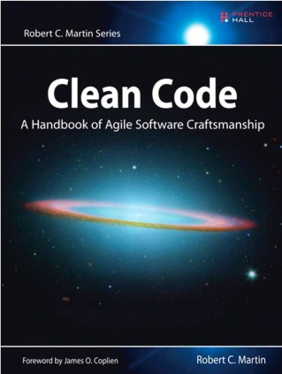

<h1 align="center">Clean Code A Handbook of Agile Software Craftsmanship</h1>

---

Table of Content :

---

## Clean code

...menulis *clean code* sangat mirip dengan melukis gambar. Sebagian besar dari kita tahu kapan sebuah gambar dilukis dengan baik atau buruk. Tetapi bisa membedakan seni yang baik dari yang buruk tidak berarti kita tahu cara melukis. Begitu juga dapat mengenali *cean code* dari *dirty code* tidak berarti kita tahu cara menulis kode yang bersih!

Seorang programmer tanpa "*code-sense*" dapat melihat modul yang berantakan dan mengenali kekacauan tersebut tetapi tidak akan tahu apa yang harus dilakukan tentang hal tersebut. Seorang programmer dengan "*code-sense*" akan melihat modul yang berantakan dan melihat opsi dan variasi.

> *Clean code* tepat dan sederhana. *Clean code* dibaca seperti prosa yang ditulis dengan baik. *Clean code* tidak pernah mengaburkan maksud perancang melainkan penuh dengan abstraksi (pemisahan) yang tajam dan baris kontrol yang mudah.
>
>Grady Booch, *author of Object Oriented Analysis and Design with Applications*.

> Kamu mengetahui bahwa kamu sedang mengerjakan *clean code* ketika setiap rutinitas yang kamu baca ternyata sesuai dengan yang kamu harapkan. Kamu dapat menyebutnya *beautiful code* ketika kode tersebut juga membuatnya terlihat seperti bahasa yang dibuat untuk masalah tersebut.
>
> Ward Cunningham, *inventor of Wiki*

*Clean code* tidak harus sesuatu yang besar. Ubah satu nama variabel menjadi lebih baik, pisahkan satu fungsi / *function* yang terlalu besar,  hilangkan sedikit duplikasi, bersihkan satu pernyataan komposit `if`.

## Meaningful Names

Mudah untuk mengatakan bahwa nama harus mengungkapkan niat....Memilih nama yang baik membutuhkan waktu tetapi menghemat lebih dari yang dibutuhkan. Jadi perhatikanlah nama (variabel, fungsi, *method*, *class*, dll) kamu dan ubahlah ketika kamu menemukan yang lebih baik.
